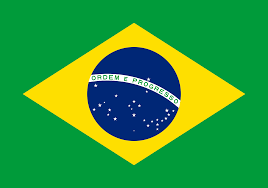

# Secret Word Game

 Projeto desenvolvido a partir do curso "React do zero à maestria" da escola Hora de Codar, neste projeto foi utilizado o react para a criação de toda a dinâmica do jogo, como por exemplo quantidade de tentativas para adivinhar a palavra, seguimento do jogo e fim de jogo.

 Project developed from the "React from scratch to mastery" course at the Hora de Codar school, in this project React was used to create the entire dynamics of the game, such as the number of attempts to guess the word, follow-up of the game and End of the game.

This template provides a minimal setup to get React working in Vite with HMR and some ESLint rules.
